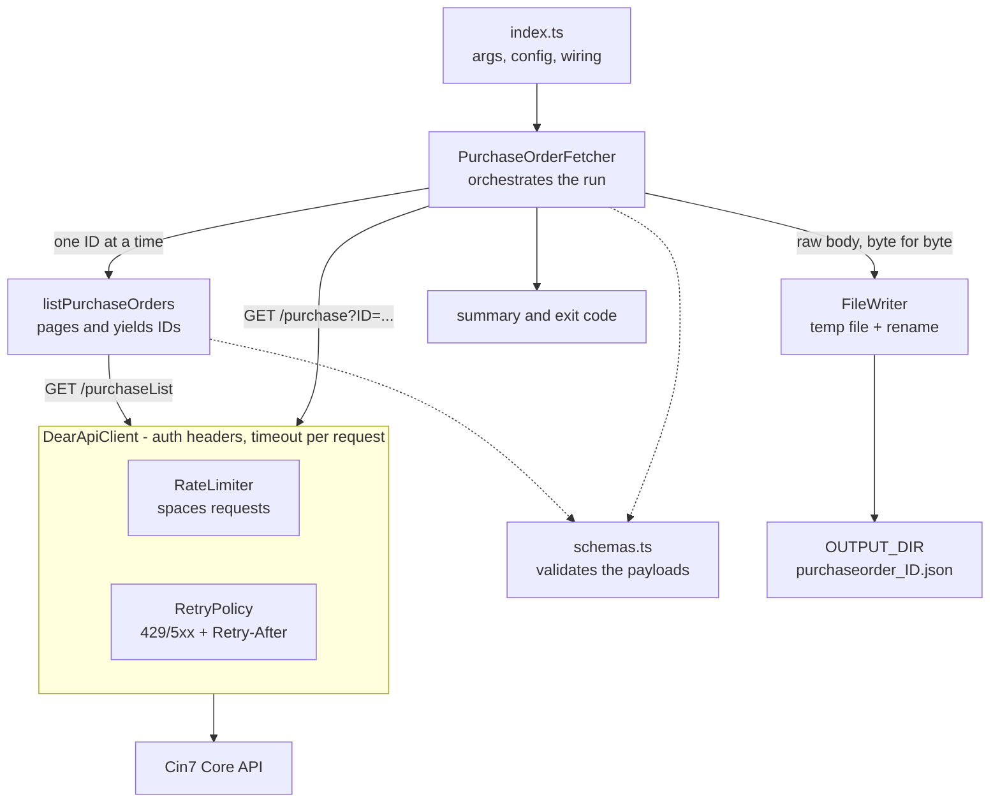

# purchase-order-api

Fetches purchase orders from the Cin7 Core (DEAR) API and archives each one as a JSON
file, byte for byte as the API sent it. Handles paging, client-side rate limiting,
retries with `Retry-After`, and atomic writes.

## Requirements

- Node.js 22.18 or newer (runs TypeScript directly; no build step)

## Setup

```sh
npm install
cp .env.example .env   # then fill in your credentials
```

## Usage

```sh
npm start                                          # orders updated in the last 30 days
npm start -- --since 2026-07-01                    # orders updated since a date
npm start -- --status AUTHORISED --search widgets  # extra filters
```

| Flag | Meaning | Default |
| --- | --- | --- |
| `--since` | lower bound for the date filter | 30 days ago |
| `--date-filter` | `UpdatedSince` or `UpdatedUntil` | `UpdatedSince` |
| `--status` | filter by order status | all statuses |
| `--search` | free-text search | none |

Each order is written to `OUTPUT_DIR` as `purchaseorder_<ID>.json`. Exit code is `0`
when every order was written and `1` when any failed.

## How it works



## Configuration

Set in `.env` (see `.env.example`):

| Variable | Purpose | Default |
| --- | --- | --- |
| `DEAR_BASE_URL` | API base URL | required |
| `DEAR_ACCOUNT_ID` | `api-auth-accountid` header | required |
| `DEAR_APPLICATION_KEY` | `api-auth-applicationkey` header | required |
| `OUTPUT_DIR` | where the JSON files go | required |
| `MAX_CONCURRENCY` | detail requests in flight at once | `4` |
| `PAGE_SIZE` | records per list page | `100` |
| `CALLS_PER_MINUTE` | client-side rate limit | `60` |
| `REQUEST_TIMEOUT_MS` | timeout per request | `30000` |
| `MAX_RETRIES` | retries after the first attempt | `3` |

## Development

```sh
npm test            # run the test suite
npm run test:watch  # rerun tests on change
npm run typecheck   # type check only, emits nothing
npm run format      # prettier over src and tests
```
